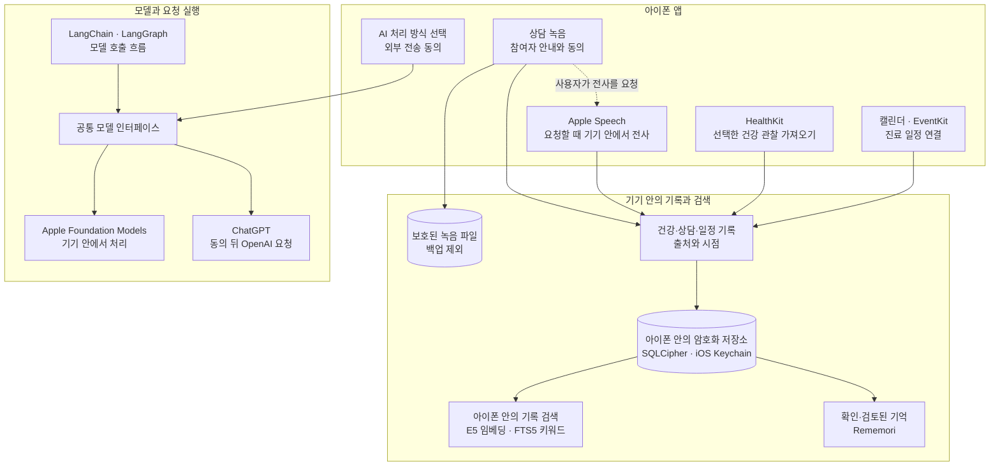

_앱 화면은 콘셉트 이미지입니다._

## 이름에 담은 뜻

오롯은 오롯이에서 온 이름입니다. 흩어진 건강 기록을 모아 내 건강의 맥락을 온전히 이해하고, 나를 위한 진료를 준비한다는 뜻을 담았습니다.

## 기록에서 다음 진료까지

오롯은 상담·건강·복약·증상 기록과 진료 일정을 정리해 다음 진료를 준비하는 개인 건강 기록 경험을 지향합니다.

### 1. 기록 모으기

상담 기록, 건강 데이터, 복약·증상 기록과 진료 일정을 한곳에 정리합니다.

### 2. 맥락 살펴보기

기록의 시점과 출처를 살펴 필요한 내용을 연결합니다.

### 3. 진료 준비하기

건강의 변화와 궁금한 점, 다음 진료에서 나눌 내용을 정리합니다.

## 오롯의 구성과 데이터 흐름

오롯은 상담·건강·일정 기록을 아이폰에 모아, 기록의 맥락을 살피고 다음 진료를 준비하도록 돕는 개인 건강 기록 앱입니다. 서로 다른 곳에서 들어온 자료는 출처와 시점을 함께 정리해 기기 안에 보관하고, 필요한 내용을 찾아볼 수 있도록 검색과 모델 실행을 나눕니다.

### 기록을 기기 안에 정리합니다

상담 녹음은 참여자에게 안내하고 동의를 확인한 뒤 시작합니다. 오디오는 백업에서 제외한 보호된 파일로 저장하며, 녹음만으로 전사가 시작되지는 않습니다. 전사가 필요하면 사용자가 별도로 요청하고 Apple Speech가 기기 안에서 처리합니다. 건강 관찰은 HealthKit에서 선택해 가져오고, 진료 일정은 iOS 캘린더와 연결합니다.

녹음 파일은 보호된 파일로 저장하고 백업에서 제외합니다. 가져온 건강·일정 기록은 SQLCipher로 암호화한 데이터베이스에 보관하며, 암호화 키는 iOS Keychain에 둡니다. 기록을 보관하고 검색하는 기본 위치는 아이폰이며, Orot 자체 서버에는 건강 기록을 저장하지 않습니다.

### 기록 검색과 AI의 역할

기록 검색은 자료를 작은 단위로 나누고, 내용의 의미와 키워드가 비슷한 대목을 아이폰 안에서 함께 찾습니다. 이 방식이 RAG(검색 증강 생성)입니다. 오픈 소스 [Rememori](https://github.com/GiorgioDotcom/rememori)는 사용자가 확인했거나 사람이 검토한 선호와 대화 맥락을 다루는 별도 메모리입니다. 메모리는 출처가 있는 상담·건강 기록을 찾는 검색과 역할이 다릅니다.

AI를 사용할 때는 앱에서 처리 방식을 고릅니다. Apple Foundation Models를 선택하면 질문과 기록이 아이폰 안에서 처리됩니다. ChatGPT를 선택하면 앱이 먼저 외부 전송 사실을 안내하고 동의를 받습니다. 동의한 뒤 ChatGPT로 요청을 보내면 질문과 사용자가 선택한 기록이 OpenAI로 전송됩니다. 여러 모델은 공통 인터페이스로 연결하고, LangChain과 LangGraph가 요청 흐름을 구성합니다.

오롯은 지금 상담·건강·일정 기록을 모으고 아이폰 안에서 정리하는 데 초점을 맞춥니다. 다음 진료 질문을 찾고, 기록 출처를 따라 내용을 살피며, 필요한 경우 외부 의학 자료까지 함께 확인하는 것은 오롯이 지향하는 진료 준비 경험입니다. 병명 가능성은 진료 때 의사와 함께 살펴볼 참고 정보이며, 의사의 진단을 대신하지 않습니다.

### 더 알아보기

세부 내용은 [상담 녹음](docs/recording.md), [기기 내 전사](docs/transcription.md), [HealthKit](docs/healthkit.md), [캘린더](docs/calendar.md), [로컬 RAG](docs/local-rag-embeddings.md), [에이전트 메모리](docs/agent-memory.md), [합성 평가 자료](packages/eval/README.md), [AI 제공자 계약](docs/provider-contracts.md)에서 확인할 수 있습니다. 개발 환경은 [개발 안내](docs/development.md), 검사 절차는 [코드 품질 안내](docs/code-quality.md), 릴리즈 절차는 [릴리즈 안내](docs/releasing.md)를 참고하세요.
