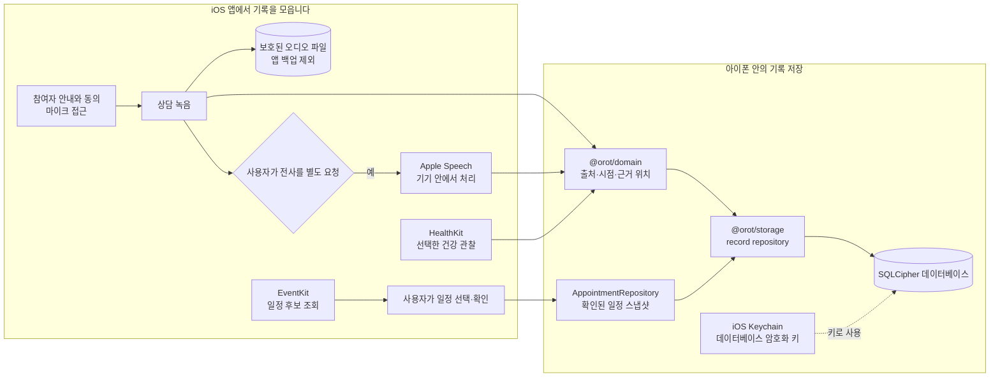
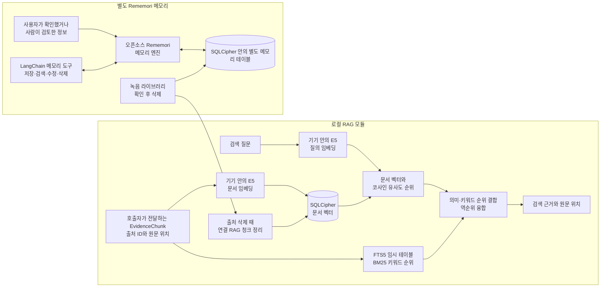
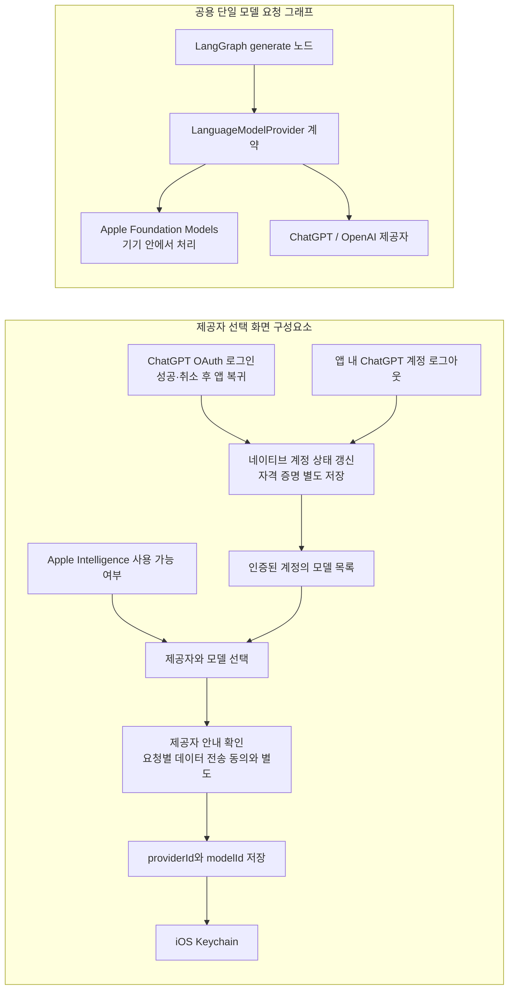
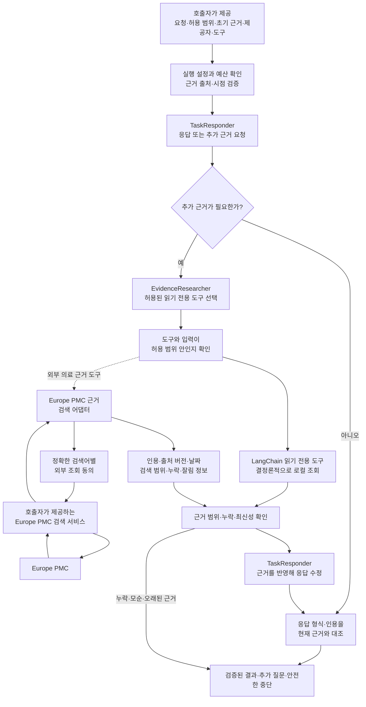
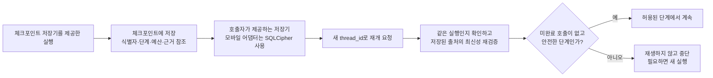

_앱 화면은 콘셉트 이미지입니다._

## 이름에 담은 뜻

오롯은 오롯이에서 온 이름입니다. 흩어진 건강 기록을 모아 내 건강의 맥락을 온전히 이해하고, 나를 위한 진료를 준비한다는 뜻을 담았습니다.

## 기록에서 다음 진료까지

오롯은 상담·건강·복약·증상 기록과 진료 일정을 정리해 다음 진료를 준비하는 개인 건강 기록 경험을 지향합니다.

### 1. 기록 모으기

상담 기록, 건강 데이터, 복약·증상 기록과 진료 일정을 한곳에 정리합니다.

### 2. 맥락 살펴보기

기록의 시점과 출처를 살펴 필요한 내용을 연결합니다.

### 3. 진료 준비하기

건강의 변화와 궁금한 점, 다음 진료에서 나눌 내용을 정리합니다.

## 오롯의 구성과 데이터 흐름

오롯은 상담·건강·일정 기록을 아이폰에 모아 다음 진료를 준비하도록 돕는 개인 건강 기록 앱입니다. 아래 흐름도는 앱 화면에서 이어지는 기록 수집·저장 경로와, 별도로 제공되는 검색·AI 구성요소의 경계를 나눠 보여줍니다.

아래 설명은 현재 iOS 앱의 구현 경로를 다룹니다.

### 저장된 기록에서 기능 모듈까지

```mermaid
flowchart LR
  imports["HealthKit 선택 가져오기"]
  recording["상담 녹음·요청형 전사"]
  audio[("보호된 오디오 파일<br/>앱 백업 제외")]
  source["@orot/domain<br/>출처 ID·시점·근거 위치"]
  calendar["EventKit 일정 후보"]
  appointment["사용자가 확인한<br/>AppointmentRepository 스냅샷"]
  local[("로컬 SQLCipher<br/>기록·벡터·memory table")]
  chunks["호출자가 구성한<br/>EvidenceChunk 스냅샷"]
  rag["@orot/rag<br/>기기 안의 E5 + FTS5"]
  reviewed["사용자 확인 또는<br/>사람이 검토한 정보"]
  memory["Rememori<br/>별도 memory table<br/>LangChain 도구"]
  ragConversation["RAG 대화 서비스<br/>검색 후 공유 실행 기반 호출"]
  hypotheses["질환 가능성 가설<br/>task service"]
  home["한국어 홈<br/>네 기능 바로 가기"]
  runtime["@orot/agent-runtime<br/>LangChain 도구·LangGraph"]
  selection["제공자 선택 화면<br/>Apple·ChatGPT OAuth"]
  provider["LanguageModelProvider<br/>제공자 중립 계약"]
  transferConsent["원격 실행 전<br/>전송 내용·수신자별 동의"]
  questions["다음 진료 질문<br/>로컬 근거·예약 연결<br/>검토·저장"]
  external["외부 근거 검색 화면"]
  queryConsent["정확한 검색어별<br/>외부 조회 동의"]
  evidenceTool["Europe PMC 근거<br/>검색 어댑터"]
  evidenceService["호출자가 제공하는<br/>Europe PMC 검색 서비스"]
  evidenceMetadata["인용·출처 버전·날짜<br/>검색 범위·누락·잘림 정보"]
  literature["Europe PMC"]

  imports --> source --> local
  recording --> source
  recording --> audio
  calendar --> appointment --> local
  local -. "호출자가 검색 단위를 전달" .-> chunks --> rag
  reviewed -. "쓰기는 별도 정책 승인 필요" .-> memory
  rag --> ragConversation --> runtime
  hypotheses --> runtime
  home --> questions
  home --> hypotheses
  home --> ragConversation
  home --> external
  local -. "최신 로컬 근거" .-> questions
  local -. "최신 로컬 근거" .-> hypotheses
  selection -. "저장된 제공자·모델" .-> provider --> runtime
  runtime -. "원격 호출 직전" .-> transferConsent -. "승인된 요청" .-> provider
  external --> queryConsent --> evidenceService --> literature
  runtime -. "호출자가 도구로 제공할 때" .-> evidenceTool --> queryConsent --> evidenceService
  literature --> evidenceService --> evidenceTool --> evidenceMetadata -. "활성 실행으로 전달" .-> runtime
```

실선은 앱 코드의 연결 경로를, 점선은 현재 근거를 모으거나 사용자 승인을 거쳐야 하는 경계를 나타냅니다. 녹음 파일은 SQLCipher 데이터베이스와 분리된 보호 파일입니다. SQLCipher의 모든 기록이 자동으로 RAG에 들어가는 것은 아닙니다. RAG는 출처가 붙은 검색 단위를 전달받아 동작합니다.

### 기록 수집과 기기 안의 저장

녹음과 전사는 별도 동작입니다. 녹음은 참여자 안내와 동의, 마이크 접근을 확인한 뒤 시작하며, 전사는 사용자가 따로 요청해야 Apple Speech가 처리합니다. HealthKit 기록은 선택해 가져옵니다. EventKit 일정 후보는 앱 안에서 확인하고, 사용자가 선택해 확인한 일정만 암호화 저장소에 남깁니다. 현재 앱의 HealthKit 공통 관찰·혈압 가져오기 화면과 EventKit 일정 흐름은 분리되어 있습니다. 하나의 통합 가져오기 흐름은 아직 연결되지 않았습니다(#106). 녹음 파일은 보호된 파일로 따로 보관하고 앱 백업에서 제외합니다. 전체 앱 데이터의 iCloud 백업·복원은 별도 구현 범위이며, README는 이를 지원되는 기능으로 설명하지 않습니다(#116). 데이터베이스 키는 iOS Keychain에 저장합니다. 건강 기록을 보관하는 오롯 자체 서버는 없습니다.

### 로컬 근거 검색과 에이전트 메모리

로컬 RAG 모듈은 호출자가 건넨 출처 연결 검색 단위를 E5로 임베딩하고, 벡터 순위와 임시 FTS5 테이블의 BM25 순위를 합쳐 근거를 반환합니다. 벡터는 SQLCipher에 저장하고, FTS5 검색 본문은 메모리 안의 임시 테이블에서 사용한 뒤 지웁니다. E5 모델과 토크나이저는 처음 사용할 때 내려받고, 검색 질문과 기록 본문은 기기 안에서 임베딩·검색합니다. 검색을 쓰는 제품 기능은 이 모듈에 검색 단위를 전달하고 결과를 연결해야 합니다.

Rememori는 호출자가 제공한 근거 조각을 검색하는 로컬 RAG와 별도의 기억 구성요소입니다. 입력에는 출처와 `user_confirmed` 또는 `human_reviewed` 검토 상태가 필요합니다. LangChain memory 쓰기 도구를 사용할 때는 호출자가 제공한 승인 정책이 필요합니다. 모든 앱 기록을 자동으로 색인하거나 모델 응답을 자동 저장하지는 않습니다. #30 질문 추천 workflow는 로컬 RAG와 검토된 memory를 근거로 조회하고, 사용자가 확인해 저장한 질문만 출처 연결 memory로 남깁니다. 이 memory는 같은 SQLCipher 데이터베이스의 별도 테이블에 저장됩니다.

저장된 녹음은 녹음 화면의 라이브러리에서 확인 후 삭제할 수 있습니다. #147의 삭제 경로는 오디오 파일 정리와 SQLCipher의 출처 종속 레코드, 연결된 RAG 청크 및 Rememori memory 삭제를 연결합니다. 삭제된 출처 식별자는 tombstone으로 보존되어 이후 쓰기와 근거 재검증에서 오래된 참조를 거부하는 데 쓰입니다. 이 경로가 전체 체크포인트 삭제를 뜻하지는 않습니다. 모든 종속 데이터와 재개 동작을 포함한 삭제 수용 기준 및 iOS Simulator 종단간 검증은 열린 #34에서 계속 확인해야 합니다.

### 제공자 선택과 모델 실행 구성요소

선택 화면은 ChatGPT OAuth 로그인과 계정 모델 목록 조회를 제공합니다. 현재 `main`에는 로그인 성공·취소 뒤 앱으로 돌아오는 흐름과 앱 안의 로그아웃, 계정 상태 갱신이 구현되어 있습니다(#123). 사용자가 고른 `providerId`와 `modelId`는 선택 저장소에 기록하고 OAuth 계정 자격 증명은 별도 네이티브 저장 경로에서 관리합니다. #123의 CI와 Simulator 검증은 합성 계정을 사용했으며 실제 ChatGPT 계정이나 iPhone에서 로그인·로그아웃한 것은 확인하지 않았습니다(#99, #113). 제공자 선택 화면은 앱 루트에서 열리지만 네 기능의 실행 서비스와는 아직 이어지지 않았습니다.

기기 안에서만 처리하는 제공자 호출에는 외부 전송이 필요하지 않습니다. 제공자 선택 화면의 안내 확인은 개인 기록을 원격 모델에 보내는 동의가 아닙니다. 외부 문헌 검색도 원격 모델 요청과 별도의 동의 경로입니다. 검색 화면은 사용자가 직접 입력한 검색어를 별도 확인 뒤 외부 검색 서비스로 보내며, 개인 기록을 자동으로 함께 보내지 않습니다. 공유 실행 기반의 Europe PMC 어댑터는 도구가 만든 정확한 검색어를 별도 동의 경계에서 확인한 뒤 검색 서비스를 호출합니다. 이 어댑터와 검색 화면의 연결은 확인되지 않았습니다. Orot에는 건강 기록을 받아 전달하는 자체 서버가 없으며, 원격 모델 요청은 연결된 기능이 동의를 받은 경우에만 선택된 내용을 해당 제공자로 보냅니다.

### 공용 멀티 에이전트 실행 기반

공용 실행 기반은 답변 담당자와 근거 조사 담당자의 역할을 분리합니다. 조사 담당자는 허용된 읽기 전용 도구와 입력만 고릅니다. 로컬 기록은 기기 안의 결정론적 도구로 조회하고, Europe PMC 도구는 정확한 검색어에 대한 별도 승인을 받은 뒤 검색 서비스를 사용합니다. 이 어댑터는 지원하지 않는 기간 조건을 거부하고 최대 다섯 건을 다루며, 인용 식별자와 출처·근거 버전, 날짜, 검색 범위의 누락·잘림 정보를 응답 역할까지 전달합니다. 체크포인트에는 외부 검색어와 검색 결과 본문을 저장하지 않고 근거 참조만 둡니다. 실행 기반은 결과의 출처·범위·최신성을 확인하고, 인용이 근거와 일치하는지 검증합니다. 근거가 모자라거나 서로 모순되면 단정적인 결과 대신 추가 질문이나 안전한 중단으로 끝냅니다. 모델 호출과 도구 사용에는 상한이 있으며 자동 재시도나 제공자 대체는 하지 않습니다. 앱 홈에서 네 기능에 바로 진입할 수 있으며, 원격 AI 요청은 선택한 제공자와 모델, 전송할 내용과 수신자를 확인한 뒤 동의를 받습니다. 외부 문헌 검색에는 검색어 전송에 대한 별도 동의가 필요합니다.

원격 처리 모드에서는 각 모델 호출 직전에 `ExecutionConsentPort`가 제공자·모델·수신자·허용 범위와 실제 전송 내용을 묶어 사용자 동의를 확인합니다. 요청 내용이 바뀌면 다시 확인해야 하며, 이 포트를 연결하는 기능은 전송 내용을 보여 주는 사용자 확인 화면을 제공해야 합니다. 로컬 처리 모드에는 원격 전송 동의가 적용되지 않습니다.

### 네 가지 사용자 기능의 현재 연결 상태

| 기능               | 현재 코드에서 확인되는 부분                                                                                                  | 앱에서 이어지는 상태                                                                                                                              |
| ------------------ | ---------------------------------------------------------------------------------------------------------------------------- | ------------------------------------------------------------------------------------------------------------------------------------------------- |
| 다음 진료 질문     | #30 workflow와 #32 화면을 사용해 질문의 근거를 열고, 검토한 질문을 예약에 저장합니다.                                            | 홈에서 바로 진입하며 확인된 예약, 연결된 기록·녹음 전사·검토한 기억을 바탕으로 질문을 준비합니다.                                               |
| 질환 가능성 가설   | 최신 로컬 기록의 근거와 반대 근거, 불확실성, 추가로 필요한 정보를 함께 보여 줍니다.                                             | 연결된 앱 기록을 사용하며 확정 진단이나 자동 약 변경을 제안하지 않습니다.                                                                        |
| 기록 기반 RAG 대화 | 로컬 RAG 검색 결과의 인용에서 원문으로 이동하고, 근거가 없거나 부족한 상태를 구분합니다.                                        | 홈에서 바로 진입하며 연결된 기록과 출처가 붙은 근거 조각을 검색합니다.                                                                            |
| 외부 의학 근거     | Europe PMC 결과의 원문 링크, 제공처, 출판·갱신·조회 날짜와 검색 범위를 표시합니다.                                               | 입력한 검색어를 별도 동의 뒤 전송하며 앱 안의 개인 기록과 외부 문헌을 구분합니다.                                                                   |

네 기능은 `App.tsx`의 홈 진입부터 각 화면과 서비스까지 연결됩니다. 다음 진료 질문은 #30의 생성 workflow와 #32 화면을 사용하며 두 기능의 소유권은 유지합니다. 질환 가설과 RAG는 현재 로컬 근거를 읽고, 외부 문헌 검색은 입력한 질의만 별도 동의 뒤 보냅니다. component와 Detox 검사는 화면·동의 경계·오류 처리를 포함하지만, 합성 자료 검사는 실제 계정이나 외부 제공자 호출의 증거가 아닙니다. 질환 가설은 의료진과 논의할 가능성을 정리하는 용도이며 진단이나 치료 결정을 대신하지 않습니다.

### 체크포인트와 합성 평가

체크포인트에는 실행 식별자와 단계, 예산, 근거 참조만 저장합니다. 사용자 문장, 건강 기록 본문, 외부 검색어와 검색 결과 본문, 도구 입력, 모델 응답과 최종 결과는 저장하지 않습니다. 새 실행 식별자를 사용해 재개하고 원본 근거가 여전히 같은지 확인합니다. 진행 중이던 외부 호출을 다시 보내지 않으며, 저장된 상태가 안전하지 않으면 중단합니다. 체크포인트 저장기는 호출자가 실행 기반에 전달할 때 사용합니다.

`@orot/eval`은 검색·에이전트·안전성 평가용 합성 기록과 기대 근거를 제공합니다. 합성 자료는 제품의 건강 기록과 분리되어 있으며 임상적으로 검증된 데이터가 아닙니다. [진료 질문 합성 평가](docs/evaluation/visit-questions.md)는 #30 워크플로를 결정적 테스트 어댑터로 평가하며 기본은 오프라인입니다. 별도 개발 실행에서 `OROT_LANGSMITH_EVAL=1`과 `LANGSMITH_API_KEY`를 지정해 opt-in하면 허용 목록에 지정된 합성 입력·기대 출력·그래프 결과·평가 점수만 LangSmith로 전송합니다. 앱 `TelemetrySink`, 실제 사용자 기록, 운영 trace, Orot backend는 사용하지 않으며, 이 결과는 실제 provider 성능이나 임상 유효성을 입증하지 않습니다.

### 더 알아보기

세부 내용은 [상담 녹음](docs/recording.md), [기기 내 전사](docs/transcription.md), [HealthKit](docs/healthkit.md), [캘린더](docs/calendar.md), [로컬 RAG](docs/local-rag-embeddings.md), [에이전트 메모리](docs/agent-memory.md), [제공자 계약](docs/provider-contracts.md), [멀티 에이전트 실행](docs/multi-agent.md), [체크포인트](docs/langgraph-checkpoints.md), [합성 평가 자료](packages/eval/README.md)에서 확인할 수 있습니다. 개발 환경은 [개발 안내](docs/development.md), 검사 절차는 [코드 품질 안내](docs/code-quality.md)를 참고하세요.
