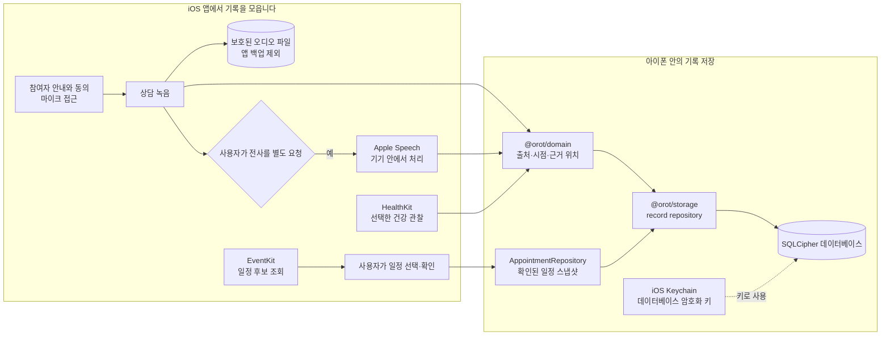
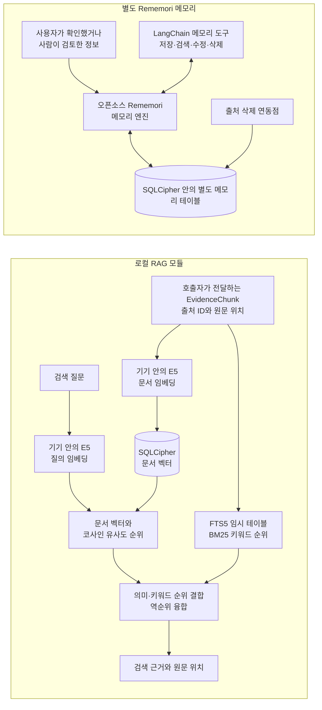
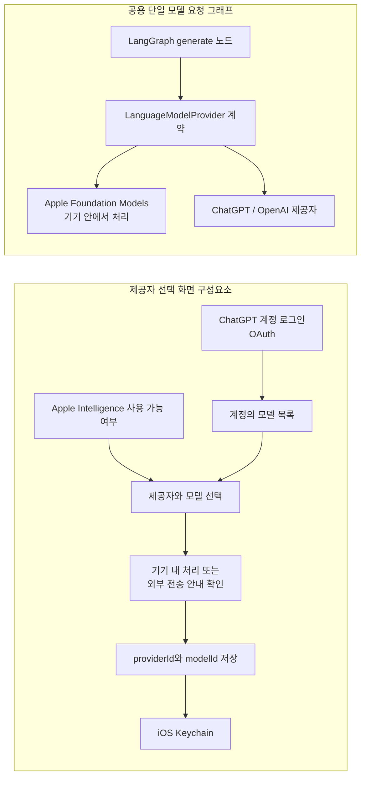
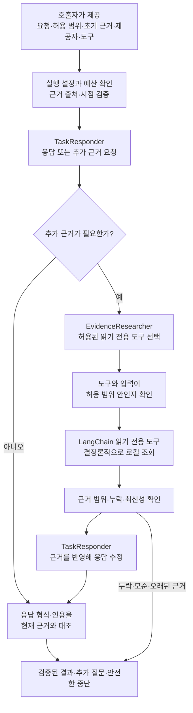
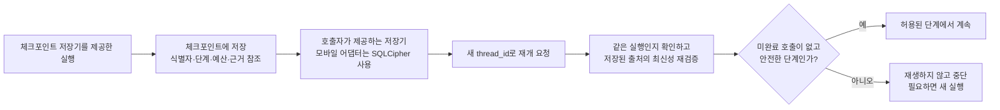

_앱 화면은 콘셉트 이미지입니다._

## 이름에 담은 뜻

오롯은 오롯이에서 온 이름입니다. 흩어진 건강 기록을 모아 내 건강의 맥락을 온전히 이해하고, 나를 위한 진료를 준비한다는 뜻을 담았습니다.

## 기록에서 다음 진료까지

오롯은 상담·건강·복약·증상 기록과 진료 일정을 정리해 다음 진료를 준비하는 개인 건강 기록 경험을 지향합니다.

### 1. 기록 모으기

상담 기록, 건강 데이터, 복약·증상 기록과 진료 일정을 한곳에 정리합니다.

### 2. 맥락 살펴보기

기록의 시점과 출처를 살펴 필요한 내용을 연결합니다.

### 3. 진료 준비하기

건강의 변화와 궁금한 점, 다음 진료에서 나눌 내용을 정리합니다.

## 오롯의 구성과 데이터 흐름

오롯은 상담·건강·일정 기록을 아이폰에 모아 다음 진료를 준비하도록 돕는 개인 건강 기록 앱입니다. 아래 흐름도는 앱 화면에서 이어지는 기록 수집·저장 경로와, 별도로 제공되는 검색·AI 구성요소의 경계를 나눠 보여줍니다.

### 기록 수집과 기기 안의 저장

녹음과 전사는 별도 동작입니다. 녹음은 참여자 안내와 동의, 마이크 접근을 확인한 뒤 시작하며, 전사는 사용자가 따로 요청해야 Apple Speech가 처리합니다. HealthKit 기록은 선택해 가져옵니다. EventKit 일정 후보는 앱 안에서 확인하고, 사용자가 선택해 확인한 일정만 암호화 저장소에 남깁니다. 녹음 파일은 보호된 파일로 따로 보관하고 앱 백업에서 제외합니다. 데이터베이스 키는 iOS Keychain에 저장합니다. 건강 기록을 보관하는 오롯 자체 서버는 없습니다.

### 로컬 근거 검색과 에이전트 메모리

로컬 RAG 모듈은 호출자가 건넨 출처 연결 검색 단위를 E5로 임베딩하고, 벡터 순위와 임시 FTS5 테이블의 BM25 순위를 합쳐 근거를 반환합니다. 벡터는 SQLCipher에 저장하고, FTS5 검색 본문은 메모리 안의 임시 테이블에서 사용한 뒤 지웁니다. 검색을 쓰는 제품 기능은 이 모듈에 검색 단위를 전달하고 결과를 연결해야 합니다.

Rememori는 기록 전체를 검색하는 RAG와 다른 메모리 구성요소입니다. 사용자가 확인했거나 사람이 검토한 선호·요약·작업 맥락만 출처 정보와 함께 저장하며, 의료 기록을 통째로 복사하거나 모델이 자동으로 기억을 만들지 않습니다. 메모리 도구는 같은 SQLCipher 데이터베이스의 별도 테이블을 사용합니다. 출처 삭제 연동점은 해당 출처를 참조하는 메모리를 함께 정리한 뒤 기록을 삭제합니다. 메모리를 사용하는 제품 기능은 이 도구와 삭제 연동점을 명시적으로 호출해야 합니다.

### 제공자 선택과 모델 실행 구성요소

선택 화면은 ChatGPT 계정에 로그인해 모델 목록을 불러오고, 외부 제공자 사용 안내를 확인한 다음 제공자와 모델 식별자만 Keychain에 저장합니다. 이 선택 화면과 단일 요청 그래프는 별도 구성요소이며, 앱 화면에서 둘을 대화 기능으로 연결하는 경로는 없습니다. 따라서 이 도식은 모델 실행 구성요소를 설명하며, 완성된 ChatGPT 대화를 앱에서 제공한다는 뜻은 아닙니다.

기기 안에서만 처리하는 제공자 호출에는 외부 전송이 필요하지 않습니다. 멀티 에이전트 실행 기반에서 원격 모델을 호출할 때는 별도의 동의 계약이 요청 직전 제공자·모델·수신자·허용 범위·실제 전송 내용을 확인합니다. 이 계약을 사용하는 기능은 사용자 확인 화면도 함께 제공해야 합니다. Orot에는 건강 기록을 받아 전달하는 자체 서버가 없으며, 원격 요청은 해당 호출이 연결되고 동의된 경우 선택된 내용만 OpenAI로 향합니다.

### 공용 멀티 에이전트 실행 기반

공용 실행 기반은 답변 담당자와 근거 조사 담당자의 역할을 분리합니다. 조사 담당자는 허용된 읽기 전용 도구와 입력만 고르고, 실제 조회는 결정론적 로컬 도구가 수행합니다. 실행 기반은 도구 결과의 출처·범위·최신성을 확인하고, 인용이 근거와 일치하는지 검증합니다. 근거가 모자라거나 서로 모순되면 단정적인 결과 대신 추가 질문이나 안전한 중단으로 끝냅니다. 모델 호출과 도구 사용에는 상한이 있으며 자동 재시도나 제공자 대체는 하지 않습니다.

원격 처리 모드에서는 각 모델 호출 직전에 `ExecutionConsentPort`가 실제 요청 내용까지 묶어 동의를 확인합니다. 로컬 처리 모드에는 원격 전송 동의가 적용되지 않습니다. 제품 기능은 이 실행 기반에 화면·제공자·기록 도구를 연결해야 합니다. 진료 질문 생성, 일정 분류, 질환 가능성 분석, 외부 의학 자료 조회는 기능별 데이터 연결과 사용자 흐름이 필요한 별도 작업입니다.

### 체크포인트와 합성 평가

체크포인트에는 실행 식별자와 단계, 예산, 근거 참조만 저장합니다. 사용자 문장, 건강 기록 본문, 도구 입력, 모델 응답과 최종 결과는 저장하지 않습니다. 새 실행 식별자를 사용해 재개하고 원본 근거가 여전히 같은지 확인합니다. 진행 중이던 외부 호출을 다시 보내지 않으며, 저장된 상태가 안전하지 않으면 중단합니다. 체크포인트 저장기는 호출자가 실행 기반에 전달할 때 사용합니다.

`@orot/eval`은 검색·에이전트·안전성 평가용 합성 기록과 기대 근거를 제공합니다. 합성 자료는 제품의 건강 기록과 분리되어 있으며 임상적으로 검증된 데이터가 아닙니다. LangSmith는 앱 밖에서 합성 자료를 평가하는 별도 계획이며, 저장소에는 LangSmith로 결과를 보내는 연동 경로가 없습니다.

### 더 알아보기

세부 내용은 [상담 녹음](docs/recording.md), [기기 내 전사](docs/transcription.md), [HealthKit](docs/healthkit.md), [캘린더](docs/calendar.md), [로컬 RAG](docs/local-rag-embeddings.md), [에이전트 메모리](docs/agent-memory.md), [제공자 계약](docs/provider-contracts.md), [멀티 에이전트 실행](docs/multi-agent.md), [체크포인트](docs/langgraph-checkpoints.md), [합성 평가 자료](packages/eval/README.md)에서 확인할 수 있습니다. 개발 환경은 [개발 안내](docs/development.md), 검사 절차는 [코드 품질 안내](docs/code-quality.md), 릴리즈 절차는 [릴리즈 안내](docs/releasing.md)를 참고하세요.
