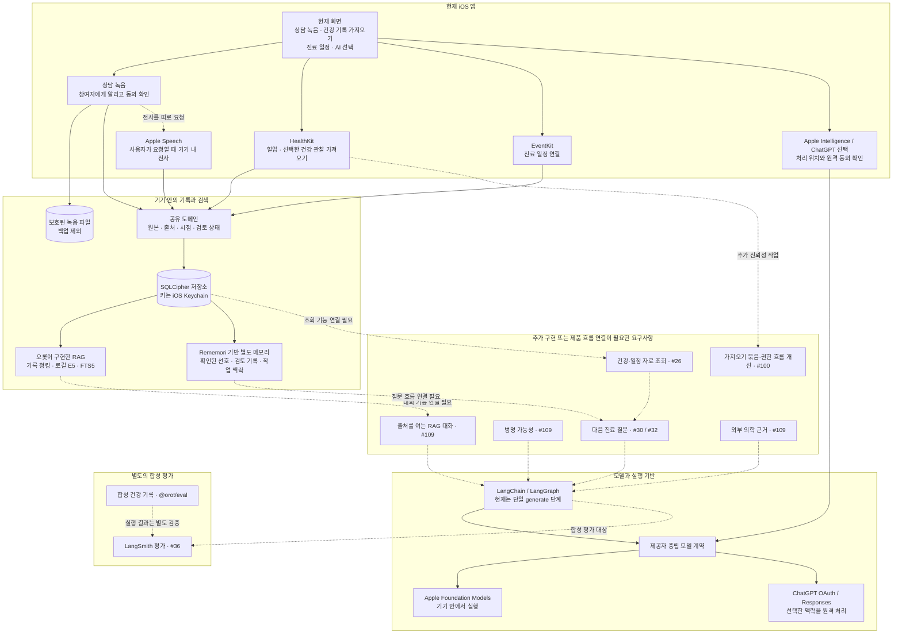

_앱 화면은 콘셉트 이미지입니다._

## 이름에 담은 뜻

오롯은 오롯이에서 온 이름입니다. 흩어진 건강 기록을 모아 내 건강의 맥락을 온전히 이해하고, 나를 위한 진료를 준비한다는 뜻을 담았습니다.

## 기록에서 다음 진료까지

오롯은 상담·건강·복약·증상 기록과 진료 일정을 정리해 다음 진료를 준비하는 개인 건강 기록 경험을 지향합니다.

### 1. 기록 모으기

상담 기록, 건강 데이터, 복약·증상 기록과 진료 일정을 한곳에 정리합니다.

### 2. 맥락 살펴보기

기록의 시점과 출처를 살펴 필요한 내용을 연결합니다.

### 3. 진료 준비하기

건강의 변화와 궁금한 점, 다음 진료에서 나눌 내용을 정리합니다.

## 현재 구현과 데이터 흐름

아래 그림은 저장소 `main`에 들어온 코드와 아직 앱 흐름에 연결되지 않은 요구사항을 나눠 보여줍니다. 실선은 현재 코드에 있는 화면이나 모듈이고, 점선은 별도 구현이 필요한 연결입니다. 모듈이 있다는 사실만으로 사용자 기능 전체가 제공된다는 뜻은 아닙니다.

### 현재 코드에서 확인되는 것

- 현재 앱 화면에서 상담 녹음, HealthKit 혈압·일부 건강 관찰 가져오기, EventKit 일정 연결, AI 제공자 선택을 열 수 있습니다. 기록과 출처 정보는 기기의 암호화 저장소에 저장합니다. 가져오기 묶음과 권한 요청 흐름의 개선은 [#100](https://github.com/eunsoogi/orot/issues/100)에서 계속 다룹니다.
- 녹음은 참여자에게 알리고 동의를 확인한 뒤 시작합니다. 오디오는 기기의 보호된 파일로 저장하며 자동으로 전사하거나 RAG에 넣지 않습니다. 사용자가 전사를 요청하면 Apple Speech가 기기에서 처리합니다.
- [직접 구현한 RAG(#23–#25)](https://github.com/eunsoogi/orot/issues/25)는 건강 기록의 청킹, 로컬 임베딩, 키워드·벡터 혼합 검색을 맡습니다. 별도의 오픈 소스 라이브러리 [Rememori](https://github.com/GiorgioDotcom/rememori) 기반 메모리([#61](https://github.com/eunsoogi/orot/issues/61))는 사용자가 확인했거나 사람이 검토한 선호·상호작용·작업 맥락을 다룹니다. 에이전트 메모리는 진료 기록 전체를 검색하는 RAG를 대신하지 않습니다.
- Apple Foundation Models와 ChatGPT는 공통 모델 계약 뒤에 있습니다. 현재 LangChain/LangGraph 그래프는 선택된 제공자에게 한 번 생성 요청을 전달하는 기본 단계이며, 질문의 근거·출처를 검증하는 진료 추천 흐름은 아닙니다.

### 아직 앱 기능으로 제공하지 않는 범위

다음 진료 질문과 그 화면은 [#30](https://github.com/eunsoogi/orot/issues/30), [#32](https://github.com/eunsoogi/orot/issues/32)에서 진행 중입니다. 로컬 건강·일정 자료 조회는 [#26](https://github.com/eunsoogi/orot/issues/26), 병명 가능성·RAG 대화·외부 의학 근거는 범위를 넓힌 [#109](https://github.com/eunsoogi/orot/issues/109)의 0.1.0 요구사항입니다. 이 계획은 병명 가능성을 근거·반대 근거·불확실성·누락 자료를 보이는 가설로 제시하고, 확정 진단이나 자동 약물 변경으로 표현하지 않으며, RAG 대화에서 원자료로 이동하고, 외부 의학 자료의 원문 링크·출처·발행·갱신 정보를 앱 내부 근거와 구분하는 것을 목표로 합니다. 현재 `main`에서 병명 가설이나 대화형 검색, 외부 의학 문헌을 제공한다고 볼 수 없습니다.

AI 선택 화면은 Apple의 기기 내 처리와 ChatGPT의 원격 처리를 구분하고, 원격 처리에는 사용자의 명시적 동의를 받습니다. 원격 요청 흐름은 사용자가 고른 자료만 제공해야 하며 다른 제공자로 자동 전환하지 않습니다. 실제 질문·건강 기록 요청 흐름은 아직 연결되지 않았고, ChatGPT 로그인 후 앱 복귀와 계정 로그아웃 보완은 [#99](https://github.com/eunsoogi/orot/issues/99), [#113](https://github.com/eunsoogi/orot/issues/113)에서 다룹니다.

LangSmith는 앱의 실시간 처리 구성요소가 아닙니다. [#36](https://github.com/eunsoogi/orot/issues/36)은 [합성 건강 기록](packages/eval/README.md)으로 추천 흐름을 평가하는 작업이며, 실제 건강 기록이나 운영 추적을 보내는 것으로 표현하지 않습니다. 로컬 출처 삭제 경로는 연결 메모리를 지우고 같은 트랜잭션에 삭제 표시를 남긴 뒤 원본 기록을 제거합니다. 이는 로컬 코드 경로의 범위이며, 앱 전체의 삭제·내보내기나 이미 외부 제공자에게 전송한 데이터의 삭제까지 보장하지는 않습니다.

Orot은 자체 백엔드를 두지 않습니다. 녹음, HealthKit·EventKit 가져오기, 기록 저장과 RAG 검색은 기기 안에서 이뤄집니다. ChatGPT를 선택하고 원격 처리를 동의한 뒤에는 선택한 맥락이 OpenAI로 전송됩니다.

세부 내용은 [상담 녹음](docs/recording.md), [기기 내 전사](docs/transcription.md), [HealthKit](docs/healthkit.md), [캘린더](docs/calendar.md), [로컬 RAG](docs/local-rag-embeddings.md), [에이전트 메모리](docs/agent-memory.md), [합성 평가 자료](packages/eval/README.md), [AI 제공자 계약](docs/provider-contracts.md)에서 확인할 수 있습니다. 개발 환경은 [개발 안내](docs/development.md), 검사 절차는 [코드 품질 안내](docs/code-quality.md), 릴리즈 절차는 [릴리즈 안내](docs/releasing.md)를 참고하세요.
