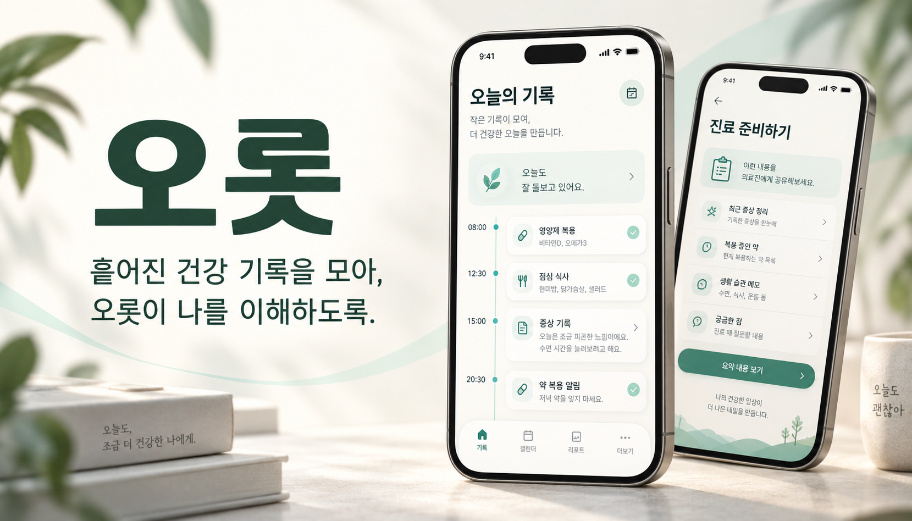
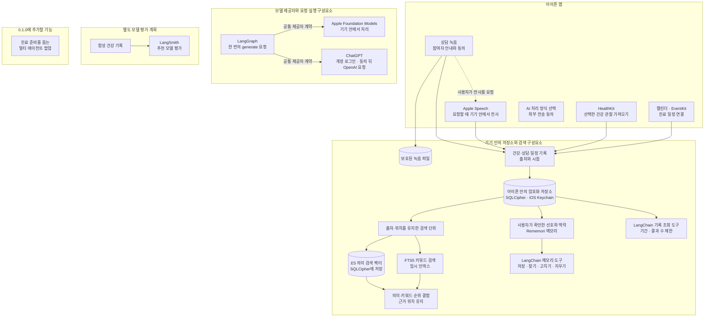

_앱 화면은 콘셉트 이미지입니다._

## 이름에 담은 뜻

오롯은 오롯이에서 온 이름입니다. 흩어진 건강 기록을 모아 내 건강의 맥락을 온전히 이해하고, 나를 위한 진료를 준비한다는 뜻을 담았습니다.

## 기록에서 다음 진료까지

오롯은 상담·건강·복약·증상 기록과 진료 일정을 정리해 다음 진료를 준비하는 개인 건강 기록 경험을 지향합니다.

### 1. 기록 모으기

상담 기록, 건강 데이터, 복약·증상 기록과 진료 일정을 한곳에 정리합니다.

### 2. 맥락 살펴보기

기록의 시점과 출처를 살펴 필요한 내용을 연결합니다.

### 3. 진료 준비하기

건강의 변화와 궁금한 점, 다음 진료에서 나눌 내용을 정리합니다.

## 오롯의 구성과 데이터 흐름

오롯은 상담·건강·일정 기록을 아이폰에 모아, 기록의 맥락을 살피고 다음 진료를 준비하도록 돕는 개인 건강 기록 앱입니다. 서로 다른 곳에서 들어온 자료는 출처와 시점을 함께 정리해 기기 안에 보관하고, 필요한 내용을 찾아볼 수 있도록 검색과 모델 실행을 나눕니다.

### 기록을 모으고 아이폰 안에 보관합니다

상담 녹음은 참여자에게 안내하고 동의를 확인한 뒤 시작합니다. 녹음만으로 전사가 시작되지는 않습니다. 전사가 필요하면 사용자가 별도로 요청하고 Apple Speech가 기기 안에서 처리합니다. 건강 관찰은 HealthKit에서 선택해 가져오고, 진료 일정은 iOS 캘린더와 연결합니다.

녹음 파일은 보호된 파일로 저장하고, 가져온 건강·일정 기록은 SQLCipher로 암호화한 데이터베이스에 보관합니다. 암호화 키는 iOS Keychain에 둡니다. 기본 보관 위치는 아이폰이며 Orot 자체 서버에는 건강 기록을 저장하지 않습니다. 0.1.0에는 녹음을 포함한 앱 데이터를 iCloud에 백업하는 기능을 추가할 계획입니다.

### 기록을 검색하고 모델에 연결합니다

오롯은 상담 기록의 전사 구간과 구조화된 건강 기록을 출처 ID와 원문 위치가 연결된 작은 검색 단위로 나눕니다. 아이폰에서 `multilingual-e5-small`로 문서와 질문을 임베딩해 의미가 가까운 단위를 찾고, 문서 벡터는 SQLCipher 데이터베이스에 저장합니다. FTS5는 임시 키워드 인덱스에서 BM25 순위를 매깁니다. 오롯은 E5 벡터의 코사인 유사도 순위와 BM25 순위를 역순위 융합(RRF)으로 합쳐 관련 근거를 돌려주며, 검색 결과에는 원본 기록과 출처 위치가 함께 남습니다. 이 근거 검색이 오롯의 로컬 RAG를 이룹니다.

Rememori는 이 기록 검색과 구분되는 별도 메모리입니다. 사용자가 확인한 선호, 사람이 검토한 대화 요약, 작업 맥락을 기억하고, LangChain 도구가 기억을 저장·검색·수정·삭제하는 동작을 감쌉니다. 의료 기록 전체를 복사해 두는 기능은 아닙니다.

기록 조회 도구도 별도로 마련되어 있습니다. LangChain 도구는 같은 암호화 저장소에서 건강 관찰, 복약 기록, 사용자가 확인한 다음 진료 일정, 선택한 상담의 전사 근거를 제한된 기간과 개수만큼 읽고 원본 출처를 반환합니다. 현재 LangGraph는 모델을 한 번 호출하는 구성요소이며, 도구를 골라 호출하고 답변의 근거를 검증하는 진료 준비 협업 흐름은 0.1.0에 추가할 계획입니다.

Apple과 ChatGPT 제공자는 공통 `LanguageModelProvider` 계약에 맞춰 요청과 응답을 정규화합니다. LangGraph 그래프는 이 제공자에게 한 번의 모델 요청을 전달하고 응답을 받으며, 그래프 상태를 SQLCipher에 저장할 수 있는 체크포인트 저장기도 있습니다. Apple Foundation Models를 선택하면 질문과 기록을 아이폰 안에서 처리합니다. ChatGPT를 쓰려면 계정에 로그인해 모델을 고르고, 앱의 외부 전송 안내에 동의해야 합니다. 요청을 보내면 질문과 사용자가 선택한 기록이 OpenAI로 전송됩니다.

0.1.0에는 여러 에이전트가 협력해 기록과 외부 의학 자료를 바탕으로 진료 준비를 돕는 기능을 추가할 계획입니다. 병명 가능성은 진료 때 의사와 함께 살펴볼 참고 정보이며, 의사의 진단이나 치료 결정을 대신하지 않습니다. 합성 건강 기록을 이용한 추천 모델의 LangSmith 평가는 앱의 실제 기록 흐름과 분리된 별도 계획입니다.

### 더 알아보기

세부 내용은 [상담 녹음](docs/recording.md), [기기 내 전사](docs/transcription.md), [HealthKit](docs/healthkit.md), [캘린더](docs/calendar.md), [로컬 RAG](docs/local-rag-embeddings.md), [에이전트 메모리](docs/agent-memory.md), [합성 평가 자료](packages/eval/README.md), [AI 제공자 계약](docs/provider-contracts.md)에서 확인할 수 있습니다. 개발 환경은 [개발 안내](docs/development.md), 검사 절차는 [코드 품질 안내](docs/code-quality.md), 릴리즈 절차는 [릴리즈 안내](docs/releasing.md)를 참고하세요.
