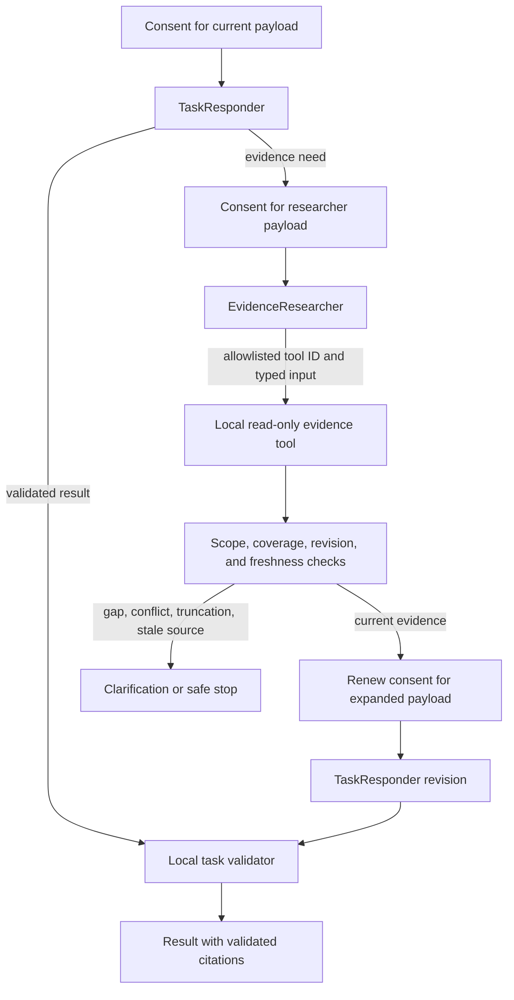

# Multi-agent execution

Orot's shared agent runtime defines a bounded handoff between two model roles and a deterministic evidence tool. A task owns its response contract; the shared runtime owns routing, budgets, consent checks, evidence validation, and safe checkpoint metadata.

## Role boundaries

- **TaskResponder** receives the task contract, user request, task context, and currently allowed evidence. It either returns a task result or asks for one bounded evidence search. Its task-specific result is checked locally before it can be returned.
- **EvidenceResearcher** receives the request, the responder's evidence need, the allowed scope, and each allowlisted tool's description and input schema. It selects one tool and returns schema-limited JSON input. The runtime locally parses that input before dispatch; the researcher does not answer the task or execute the search.
- **Evidence tools** are injected deterministic `local_read_only` functions. The runtime dispatches only the selected tool after checking its ID, source kind, and locally parsed input. Model tool calls are not enabled; any provider response containing a tool call is rejected.

The default run permits at most three model calls (responder, researcher, responder revision), one tool call, one research cycle, eight evidence items, 64 KiB per model payload, 768 output tokens, and 45 seconds. Callers may choose smaller budgets within the hard maxima. There are no hidden model retries or provider fallbacks.

## Evidence and result checks

Evidence references retain source kind, source and evidence IDs, both revisions, a locator, effective time, unit, and review state. Query time ranges use exact half-open `fromInclusive` and `toExclusive` bounds. Coverage retains searched source IDs, requested and covered time ranges, gaps, truncation, result limit, and returned count. Tool results outside the selected tool's source kind, source ID, or time scope are rejected. Before the responder sees a result, the runtime checks that source revisions remain current. It returns clarification instead of a task result when coverage is missing, truncated, contradictory, or unchanged by the search.

The shared runtime includes adapters for `LocalRecordQueryService` health observations and transcript evidence. They pass the caller's half-open range unchanged, require a row limit no greater than the query API's 100-row cap, retain `hasMore` as coverage truncation, and let the storage API reject ranges longer than 366 days. Transcript adapters are bound to one `recordingSourceId`, which must already be in the allowed source IDs; stale derived-artifact links remain conflicts. The current health-observation query API cannot filter to individual record IDs, so its adapter rejects a scope that requests record-ID filtering. Each feature supplies the record-to-evidence mapper so source revisions, evidence revisions, locators, units, and review state remain tied to that feature's authoritative record contract.

The task responder supplies a JSON schema and a local `validateResult` function. Providers advertising structured output receive the schema in their request. Other providers return JSON text that the runtime parses locally. In both cases, the runtime validates the role protocol, task result, and every citation. A citation must exactly match a reference in the current evidence batch; unknown, stale, or duplicate citations are rejected.

## Consent and cancellation

Every remote model call goes through `ExecutionConsentPort.authorize` before provider dispatch. The request binds the selected provider, model, recipient, allowed evidence scope, and concrete messages sent to the model. The mobile `createExecutionConsentRegistry` reuses approval only for the same complete snapshot. Its confirmation callback must return `true` only after an explicit user action; a changed payload, provider, model, recipient, or scope requires a fresh confirmation. The registry keeps the canonical snapshot in its private in-memory closure and does not persist or log it. A local model call does not require remote-processing consent.

The provider contract does not accept an abort signal for `generate`. If a run is cancelled while that promise is outstanding, the runtime returns `underlying_call_unconfirmed` and stops every downstream node. For streaming providers, it requests iterator return and reports `iterator_return_requested`; that observation does not prove that the provider stopped its underlying operation.

## Checkpoint and relaunch behavior

LangGraph state contains only the operation/provider/model IDs, allowed scope and budgets, phase and call counts, evidence references, a small evidence-need enum, selected tool ID, pending-operation key, and terminal flag. It excludes user text, context, evidence content, tool input, model responses, citations, and final results. The existing checkpoint saver can persist this metadata when the caller supplies a per-run `thread_id`.

An in-flight model or tool operation is marked pending before dispatch. A saved pending operation is not replayed. After relaunch, callers may pass a safe `resumeFrom` checkpoint; the runtime requires the same run identity, rejects pending or completed state, revalidates source revisions, and restores only the exact saved references. A checkpoint at the search phase cannot resume because its private query was intentionally omitted. A completed run cannot recover its result from a checkpoint, so callers must start a fresh run. When a checkpoint saver already has state for a thread, starting another invocation on that thread fails closed.

## Current integration boundary

This package provides shared contracts, bounded local-query adapters, and synthetic behavior tests. No feature screen, provider adapter, external search adapter, or automatic memory-writing tool is added here. Visit-question generation (#30), calendar classification (#108), and disease-hypothesis/RAG/external-evidence behavior (#109) retain their feature ownership and are not integrated by this contract alone. The mobile consent registry is an integration point; its caller supplies the explicit confirmation UI.

The handoff and consent tests use synthetic fixtures. They prove deterministic contract behavior, not a real provider session, personal-record access, or feature-level integration.
